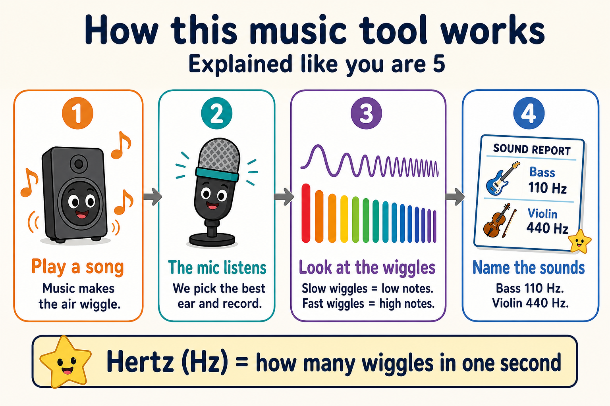

# Symphony Instrument Analysis

Standalone mic-capture + spectral analysis project (**not** related to FlexAIDdS).

**iOS / iPadOS / Mac (no ports):** the app ships as a Swift Playgrounds package [`ios/CrayonPiano.swiftpm`](ios/CrayonPiano.swiftpm) — run it directly on **iPadOS 27** in Swift Playgrounds (no Mac needed) or on **macOS 27** in Xcode / Swift Playgrounds. Tap keys, listen through the mic, or replay the built-in demo on the scrolling waveform. See [`ios/README.md`](ios/README.md).

**Web, also no server:** open [`web/keyboard.html`](web/keyboard.html) in Safari (or Chrome). Hold piano keys or type the computer keyboard — **Z = Do3**, **D = Do4**, **Q = La4** — to play crayon notes; **Rejouer** uses a built-in demo if `samples/final_song.wav` is missing. Live mic on iPhone needs the native app above (Safari blocks `getUserMedia` on `file://`). Details in [`web/README.md`](web/README.md).

**Terminal (same layout):** `.venv/bin/python scripts/crayon_piano.py` — Listen / Rejouer, musician lanes, chroma, keyboard. No time slider. Optional `--wav` 16-bit PCM.

Records from the best available macOS mic, denoises, then estimates:

- likely instrument families (vocals/lyrics de-emphasized)
- note sequences with frequencies in Hz

## Public live listen (phone on 5G, any network)

The tutorial is a static HTTPS page. Open it **on the device that is making sound**. It uses that device’s microphone (audio only). Soft auto-gain lifts quiet rooms and headphone bleed. It does not play music. `127.0.0.1` and LAN IPs are not reachable on cellular. The public UI is **English and French** first (EN / FR). Live tracks: **density-clustered** — lane count follows the sound.

**Canonical URL** after GitHub Pages is switched on for this repo (Settings → Pages → Source: **GitHub Actions**). Project Pages then appear under the existing `thebonhomme.com` user-site domain. Do **not** attach a CNAME of `thebonhomme.com` to this repo, or the homepage would be stolen:

- Hub: https://thebonhomme.com/SymphonyInstrumentAnalysis/
- Live listen: https://thebonhomme.com/SymphonyInstrumentAnalysis/tutorial/
- Crayon piano (US or Canadian French): https://thebonhomme.com/SymphonyInstrumentAnalysis/piano/
- ELI5: https://thebonhomme.com/SymphonyInstrumentAnalysis/how-to.html

One-click: [Pages settings](https://github.com/LeBonhommePharma/SymphonyInstrumentAnalysis/settings/pages). The deploy workflow is `.github/workflows/pages.yml`. `GITHUB_TOKEN` cannot create the Pages site from this agent; that toggle is the missing step.

Fastest 5G path that already has HTTPS: copy this `docs/` folder to `symphony/` on `lebonhommepharma.github.io` (this bot cannot push that repo). Then open https://thebonhomme.com/symphony/tutorial/ on the phone.

On an iPhone, tap **Listen with the mic** and allow Microphone. Tab/window capture is a desktop feature.

Local-only fallback (this computer, not 5G):

```bash
python3 scripts/serve_tutorial.py
```

## How-to (ELI5)

Sound is air wiggling. We count the wiggles per second (**Hz**), then name the instruments and notes.



Full walkthrough: [docs/HOW_TO_ELI5.md](docs/HOW_TO_ELI5.md) or [docs/how-to.html](docs/how-to.html). Live page: [docs/tutorial/index.html](docs/tutorial/index.html).

### Homepage card (layout-safe)

This bot cannot push `lebonhommepharma.github.io`. Add **one object** to the existing `footerLinks` and `products` arrays in the bundled `index.html` (same card grid, no header/nav/CSS changes). Point at the Pages URL above, or at `/symphony/` if you copy `docs/` into that folder on the homepage repo.

`footerLinks` (after Shannon):

```js
{ name: "Symphony", role: "live listen", glyph: "Hz", c: "var(--cyan)", href: "https://thebonhomme.com/SymphonyInstrumentAnalysis/tutorial/", target: "", rel: "" },
```

`products` (after Shannon):

```js
{ name: "Symphony", kind: "Instrument Analysis", glyph: "Hz", c: "var(--cyan)", href: "https://thebonhomme.com/SymphonyInstrumentAnalysis/tutorial/", cta: "Live listen", desc: "Silent live-listen: see the Hertz of whatever this device is already playing. No background music." },
```

### Flawless HTTPS (`thebonhomme.com` + `www`)

`https://thebonhomme.com` is already a valid GitHub Pages / Let's Encrypt cert (`SAN: thebonhomme.com`).

`https://www.thebonhomme.com` is **not**. GoDaddy has `www` as a CNAME to the apex (`thebonhomme.com`). That lands on GitHub's IPs, but GitHub has not put `www` on the Pages certificate, so TLS presents `*.github.io` and browsers abort before the HTTP 301 to the apex.

GitHub only mints one cert covering **both** names when DNS is:

| Type | Name | Value |
| --- | --- | --- |
| A | `@` | `185.199.108.153` `109.153` `110.153` `111.153` (already correct — keep) |
| CNAME | `www` | `lebonhommepharma.github.io` (**not** `thebonhomme.com`) |
| AAAA | `@` | `2606:50c0:8000::153` … `8003::153` (optional, recommended) |

Do **not** delete MX, SPF, Apple, Microsoft 365, or ENS TXT records.

**Panel (one edit):** [GoDaddy DNS for thebonhomme.com](https://dcc.godaddy.com/control/thebonhomme.com/dns) → CNAME `www` → `lebonhommepharma.github.io` → save. Wait for GitHub to re-issue Let's Encrypt (minutes, sometimes up to an hour). Confirm:

```bash
python3 scripts/https_cert.py
```

You want `FLAWLESS` (www SAN includes `www.thebonhomme.com`). If DNS is right but the cert is still `*.github.io`, on [homepage Pages settings](https://github.com/LeBonhommePharma/lebonhommepharma.github.io/settings/pages) remove and re-add custom domain `thebonhomme.com` (apex stays primary; GitHub then certifies www automatically).

**API:** production key at [developer.godaddy.com/keys](https://developer.godaddy.com/keys), then:

```bash
export GODADDY_API_KEY=...
export GODADDY_API_SECRET=...
python3 scripts/https_cert.py --apply-dns
```

Or repo Actions secrets `GODADDY_API_KEY` + `GODADDY_API_SECRET` and run workflow **Fix www HTTPS (GoDaddy)**. The script only PUTs `CNAME www` and missing apex `AAAA`; it will not replace the rest of the zone.

Do **not** add a `_github-pages-challenge-…` TXT until GitHub shows the token (Pages → Custom domain → Verify). Domain state is currently `unverified`; that does not block the apex cert, but verifying is still a good idea.

If GitHub Pages is not on for this repo yet: **Settings → Pages → Source: GitHub Actions** ([open](https://github.com/LeBonhommePharma/SymphonyInstrumentAnalysis/settings/pages)). The workflow is `.github/workflows/pages.yml`. Actions cannot create the site until that source is selected.

## Setup

Debian/Ubuntu (install OS packages first; `python3-venv` matches the default `python3`):

```bash
sudo apt-get update
sudo apt-get install -y python3-venv ffmpeg
python3 -m venv .venv
source .venv/bin/activate
pip install -r requirements.txt
```

Cloud / repeatable install:

```bash
bash .cursor/install.sh
```

Verify the analysis path (works without a microphone):

```bash
python3 scripts/smoke_test.py
```

## Usage

```bash
# list mics
python3 scripts/list_mics.py

# probe which mic has best signal / least noise
python3 scripts/probe_mics.py

# record (auto-picks best mic; play music while it runs)
python3 scripts/record_mic.py --seconds 90

# analyze (crayon-piano peak-picker; vocals and highs included)
python3 scripts/analyze_instruments.py captures/<file>.wav
```

Outputs land in `analysis_out/` (Markdown + JSON). Raw WAVs stay local in `captures/` (gitignored).

`list_mics.py` / `probe_mics.py` / `record_mic.py` use macOS AVFoundation. Without a capture device they exit 1 with `No AVFoundation audio devices found.` On Linux, use `smoke_test.py` or feed a 16-bit PCM WAV to `analyze_instruments.py`.
